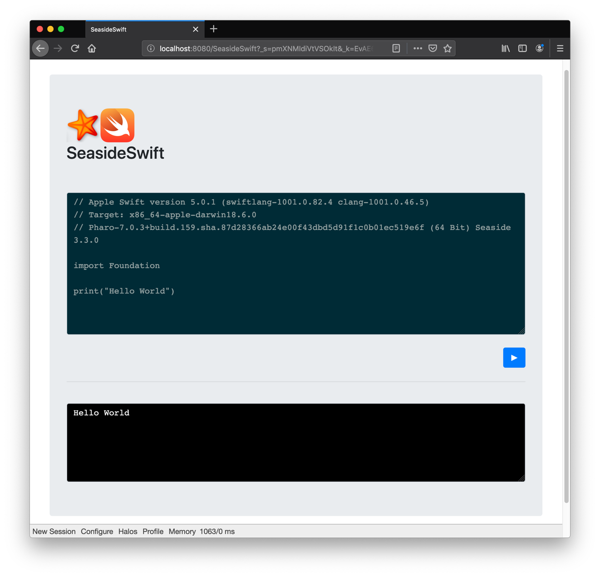
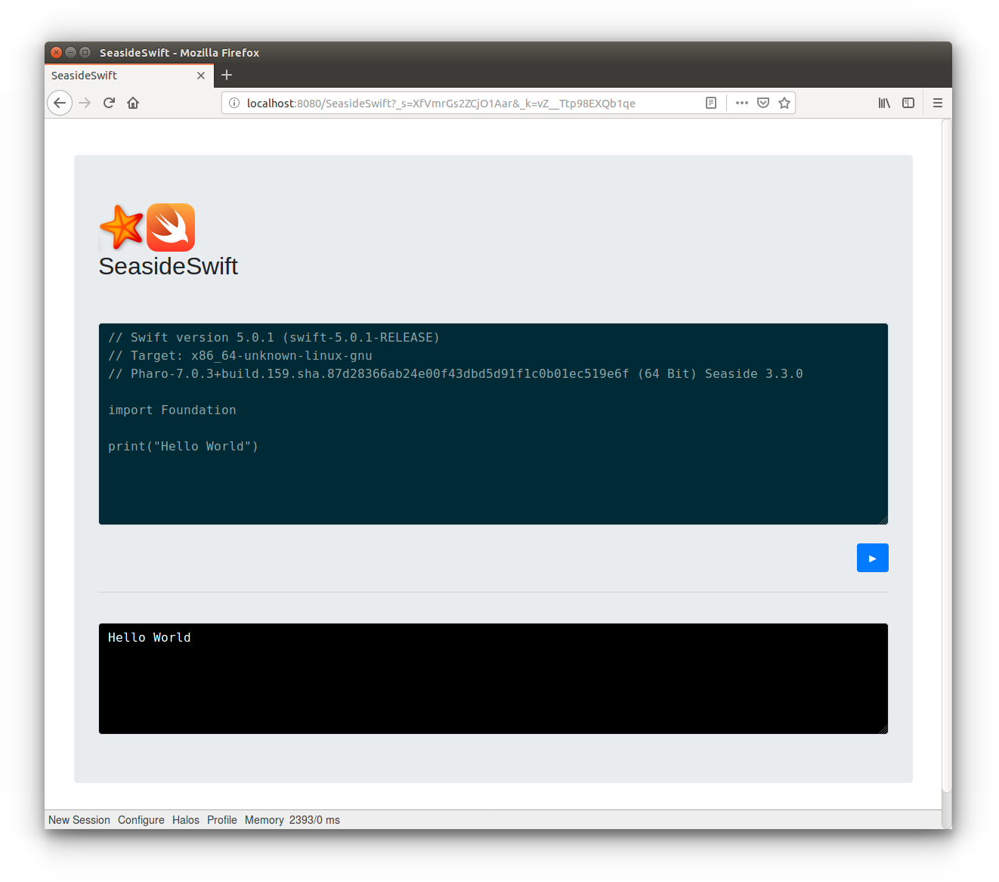

SeasideSwift
============

**A cross-platform Swift web code runner served by [Seaside](https://github.com/SeasideSt/Seaside) on [Pharo](https://www.pharo.org/).**

Similar commercial implementations are used at [Repl.it](https://repl.it) and [OnlineSwiftPlayground.run](http://onlineswiftplayground.run).

* [Pharo 8.0](https://www.pharo.org/) reference platform.
* Requires macOS (tested with 10.15.4) ***or*** GNU/Linux (tested with Ubuntu 14.04, 64 bit) ***and*** the Swift tools (see _Installation_).

## Installation

1. Install and setup the Swift tools for your environment:
    * **macOS:** Install the [Command Line Tools for Xcode](https://developer.apple.com/download/more/?=command%20line%20tools).
    * **GNU/Linux:** [Install Swift](https://www.swift.org/getting-started/#installing-swift) from [swift.org](https://www.swift.org/).
2. In a Playground, _Do It_:

    ```smalltalk
    Metacello new 
      repository: 'github://brackendev/SeasideSwift';
      baseline: 'SeasideSwift';
      onConflict: [ :ex | ex useIncoming ];
      onUpgrade: [ :ex | ex useIncoming ];
      onDowngrade: [ :ex | ex useLoaded ];
      ignoreImage;
      load.
    ```

## Usage

In a Playground, _Do It_:

```smalltalk
"Start the service"
SeasideSwift shared start.
```

```smalltalk
WebBrowser openOn: 'http://127.0.0.1:8080/SeasideSwift/'.
```

```smalltalk
"Stop the service"
SeasideSwift shared stop.
```

Additionally, HTTP POST requests are supported with [Teapot](https://github.com/zeroflag/Teapot). For example, the following curl command returns `Hello, World!`.

```bash
curl -X "POST" "http://127.0.0.1:8081/swift" \
-H 'Content-Type: text/plain; charset=utf-8' \
-d "print(\"Hello, World!\")"
```

## Screenshots

#### macOS



#### GNU/Linux



## Acknowledgements

This project makes use of the following third-party libraries:

* [Seaside](https://github.com/SeasideSt/Seaside)
* [Seaside-Bootstrap4](https://github.com/astares/Seaside-Bootstrap4)
* [SwiftPlayground-Pharo](https://github.com/brackendev/SwiftPlayground-Pharo)
* [Teapot](https://github.com/zeroflag/Teapot)
* [Zinc HTTP Components](https://github.com/svenvc/zinc)

## Author

[brackendev](https://www.github.com/brackendev)

## License

SeasideSwift is released under the MIT license. See the LICENSE file for more info.

- - -

## Useful Links

* [@pharoproject](https://twitter.com/pharoproject) [Twitter]
* [@swiftlang](https://twitter.com/SwiftLang) [Twitter]
* [pharo.org](https://www.pharo.org/)
* [swift.org](https://www.swift.org/)
